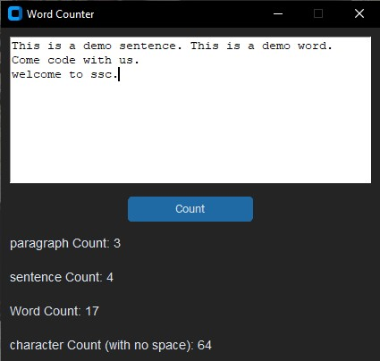
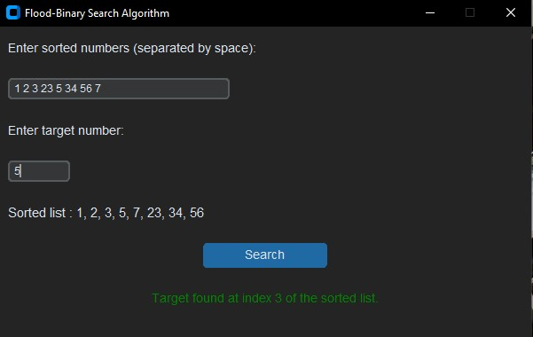

<!-- For a better view of this file please visit https://github.com/issachar-j/ict-assignment.git -->

# [ICT Python Assignment](https://github.com/issachar-j/ict-assignment.git) 💻


### Word counter 📖

A program fully hard coded to count the number of characters, words, sentences and paragraphs.

 -----------------

 -----------------

### Algorithm implementation -- Binary Search 🔍

A fully hard coded implementation of the binary search algorithm using python.

 -----------------

 -----------------


# Dependencies 🔌

| Python | 
| ------ | 

| Customtkinter |
| ------------- |

```bash
pip install customtkinter
```
### Tips 📝
- Install Python from www.python.org
- Have a running environment for python, we recommend visual studio codes 
- If have any problems or questions please contact us via [Telegram](https://t.me/Issachar_0)

# Github Repository
- [Public Repository](https://github.com/issachar-j/ict-assignment.git)

# Team (linked to personal telegram account)
- [Yisakor Eyob -- 12C](https://t.me/Issachar_0)
- [Nathan Bekele -- 12C](https://t.me/Nate_bt)
- [Medan Zelealem -- 12C](https://t.me/LoveisJesus7)
- [Arsema Haileysus -- 12C](https://t.me/T2e7mT1e9k)
